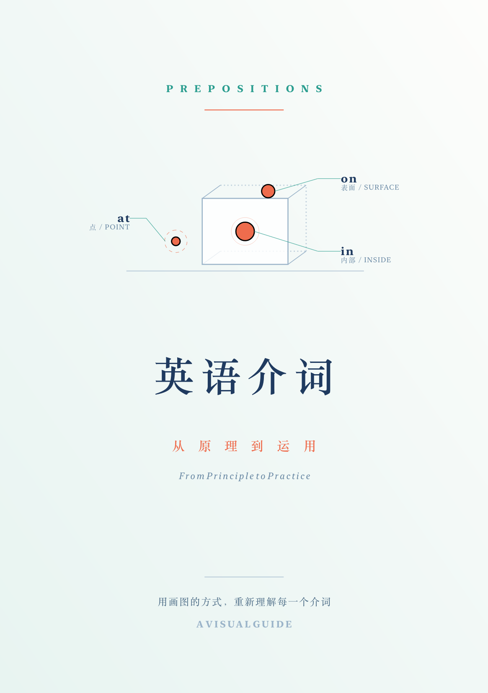
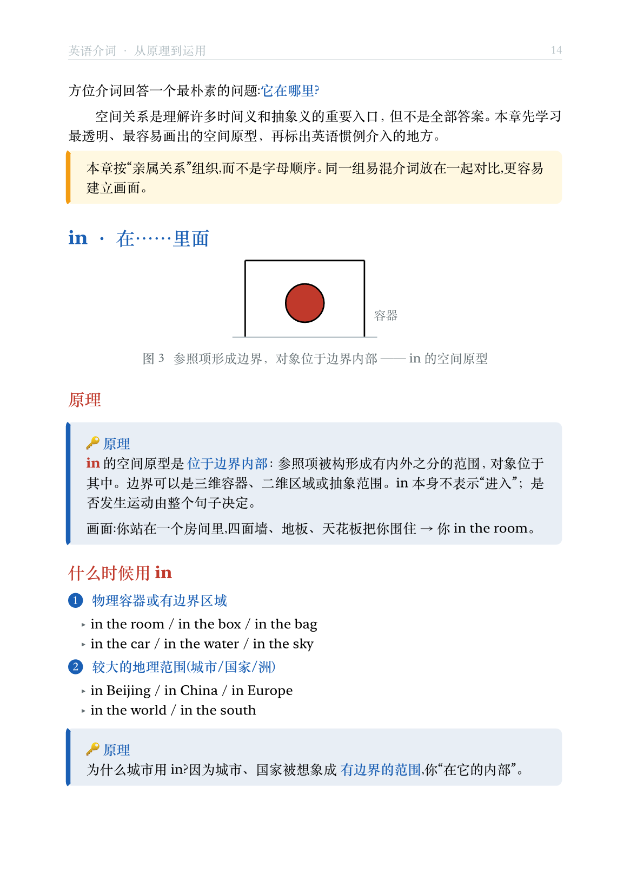
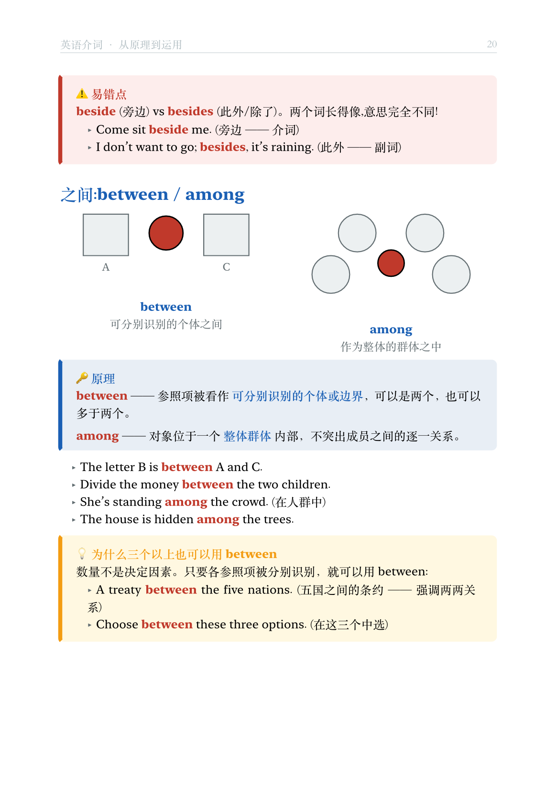
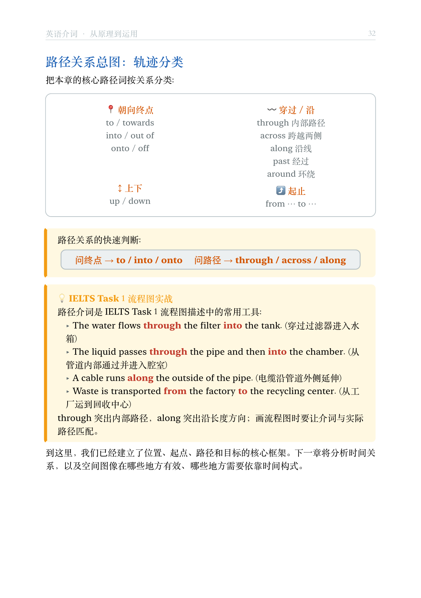

# 《英语介词 · 从原理到运用》

一本用「画图讲原理」方式系统讲解英语介词的 Typst 书籍。

## 预览

<table>
  <tr>
    <td align="center">封面</td>
    <td align="center">方位示意图 · in / on / at</td>
  </tr>
  <tr>
    <td></td>
    <td></td>
  </tr>
  <tr>
    <td align="center">对比图 · between / among</td>
    <td align="center">时间轴 · at / on / in</td>
  </tr>
  <tr>
    <td></td>
    <td></td>
  </tr>
</table>

## 成品

- **PDF**: 见 [Releases](https://github.com/swiftczz/prepositions-book/releases) 页面下载
- **源码**: 见下方文件结构

## 如何编译

需要安装 [Typst](https://typst.app)（已验证 v0.15.0）:

```bash
cd prepositions-book
typst compile main.typ "英语介词-从原理到运用.pdf"
```

首次编译会自动下载 `@preview/cetz`（绘图库）。

> 字体依赖:macOS 自带的 `Songti SC`（宋体）、`PingFang SC`、`New York`、`Times New Roman`。若在其他系统编译,可改 `main.typ` 顶部的字体列表。

## 文件结构

```
prepositions-book/
├── main.typ              # 主入口:页面/字体/标题样式 + 串联各章
├── theme.typ             # 主题:配色、组件函数(tip/story/warn/callout 等)
├── diagrams.typ          # 绘图函数库:所有 cetz 示意图(in/on/at/through/timeline…)
├── ch00-cover.typ        # 封面 + 版权页 + 目录 + 前言
├── ch01-principles.typ   # 第1章 核心原理(点·面·体、空间→时间隐喻)
├── ch02-place.typ        # 第2章 方位介词(in/on/at、上下家族、between/among…)
├── ch03-movement.typ     # 第3章 方向介词(to/into/through/across/along…)
├── ch04-time.typ         # 第4章 时间介词(时间轴图 + since/for/by/until 辨析)
├── ch05-abstract.typ     # 第5章 其他介词(of/for/with/by + 词源故事 + 示意图)
├── ch06-phrases.typ      # 第6章 介词短语与 IELTS 高频搭配
├── ch07-appendix.typ     # 附录 速查表 + 名词/动词搭配
├── cover-new.typ         # 封面主视觉(cetz 绘图)
└── screenshots/          # README 预览图
```

## 内容特色

| 章节 | 教学方法 |
|------|----------|
| 核心原理 | **点·面·体**:用 at/on/in 一套原理统摄所有介词 |
| 方位介词 | **空间示意图**:红球 + 灰盒展示 in/on/at/under/between 等位置关系 |
| 方向介词 | **箭头运动图**:into/through/across/along 带方向轨迹 |
| 时间介词 | **时间轴图**:点(at)·段(on)·长段(in)的可视化 |
| 其他介词 | **词源故事 + 示意图**:of/for/with/by 的起源画面 |
| 短语搭配 | **IELTS 实战**:Task 1/2 高频名词-介词搭配 |

## 修改指南

- **改配色**:编辑 `theme.typ` 顶部的 `c-primary` / `c-accent` 等变量
- **加新介词条目**:仿照 `ch02-place.typ` 里 `in` 的结构(图 → 原理 → 用法 → 例句)
- **加新示意图**:在 `diagrams.typ` 仿照 `fig-in()` 写一个 `fig-xxx()`,用 cetz 的 `canvas/draw`
- **加新 callout 框**:用 `theme.typ` 的 `tip()` / `story()` / `warn()` / `principle()`
